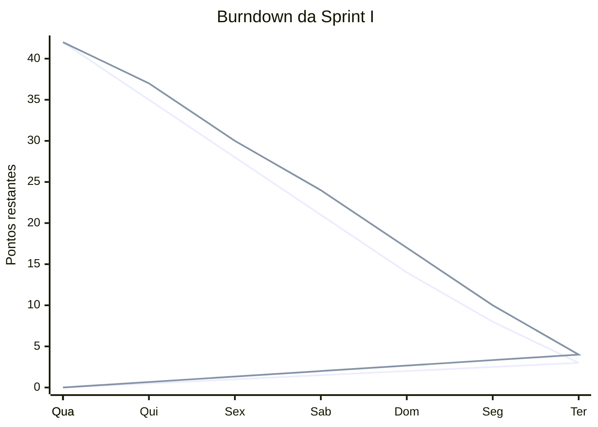

# Entregaveis da Sprint I

Projeto: Sistema de busca de informacoes de pesquisadores baseado em Full-Text Search e LLM
Sprint: I - Projeto
Fonte: `Sprint_I_Kanban.md`

## Mapa dos Entregaveis Organizados

| Entregavel | Arquivo |
| --- | --- |
| Requisitos funcionais e nao funcionais | `entregaveis/requisitos/requisitos_funcionais_nao_funcionais.md` |
| Historias de usuario | `entregaveis/historias_usuario/historias_de_usuario.md` |
| Diagrama de casos de uso | `entregaveis/diagramas/casos_de_uso.png` |
| Modelo entidade-relacionamento | `entregaveis/diagramas/DER.png` |
| Prototipo de media fidelidade | `entregaveis/prototipos/prototipo_media_fidelidade.html` |
| Projeto arquitetural | `entregaveis/arquitetura/projeto_arquitetural.md` |
| Diagrama arquitetural | `entregaveis/arquitetura/diagrama_arquitetural.svg` |
| Grafico de burndown | `entregaveis/scrum/grafico_burndown_sprint_i.svg` |
| Burndown da Sprint I | `entregaveis/scrum/burndown_sprint_i.md` |

## 1. Grafico de Burndown da Sprint I

Total estimado da Sprint I: 42 pontos.

### Tabela do burndown planejado

| Dia | Pontos planejados restantes | Pontos reais restantes |
| --- | ---: | ---: |
| Quarta-feira | 42 | 42 |
| Quinta-feira | 35 | 37 |
| Sexta-feira | 28 | 30 |
| Sabado | 21 | 24 |
| Domingo | 14 | 17 |
| Segunda-feira | 8 | 10 |
| Terca-feira | 3 | 4 |
| Quarta-feira | 0 | 0 |

### Grafico em Mermaid




### Leitura do grafico

O burndown representa a reducao planejada e a reducao real do trabalho da Sprint I ao longo de uma semana. A sprint inicia com 42 pontos estimados e chega a zero pontos na quarta-feira de encerramento, apos a consolidacao dos artefatos de analise, modelagem, prototipo e preparacao da apresentacao.

A linha real ficou acima da planejada durante a maior parte da sprint, indicando atraso moderado na queima dos pontos, mas convergiu para 0 no encerramento.

## 2. Requisitos Funcionais

### RF-01 - Importar curriculos Lattes em XML

O sistema deve permitir a importacao de arquivos XML do Curriculo Lattes por meio de um fluxo de ETL.

Origem: HU-01
Prioridade: Alta
Usuarios envolvidos: Administrador
Criterios de aceitacao:

- Dado um XML valido do Lattes, quando o pipeline for executado, entao os dados do pesquisador devem ser gravados no banco.
- O sistema deve registrar producoes cientificas associadas ao pesquisador.
- O processo deve evitar duplicidade basica de pesquisadores e producoes.

### RF-02 - Armazenar dados estruturados dos pesquisadores

O sistema deve armazenar pesquisadores, curriculos, producoes cientificas, areas de atuacao e palavras-chave em banco relacional PostgreSQL.

Origem: Escopo do projeto e KAN-10
Prioridade: Alta
Usuarios envolvidos: Administrador, Usuario pesquisador, Professor/Gestor
Criterios de aceitacao:

- O banco deve conter entidades para pesquisadores, curriculos e producoes cientificas.
- As producoes devem estar associadas aos seus respectivos pesquisadores.
- Areas e palavras-chave devem ser relacionadas aos pesquisadores e/ou producoes quando disponiveis no XML.

### RF-03 - Buscar producoes cientificas por texto

O sistema deve permitir que usuarios pesquisem producoes cientificas por termos textuais, considerando principalmente o titulo das producoes.

Origem: HU-02
Prioridade: Alta
Usuarios envolvidos: Usuario pesquisador, Professor/Gestor, Aluno
Criterios de aceitacao:

- A busca deve considerar o titulo das producoes.
- O resultado deve listar titulo, ano, pesquisador e tipo de producao.
- O usuario deve conseguir combinar busca textual com filtros basicos.

### RF-04 - Buscar producoes cientificas por similaridade semantica

O sistema deve permitir busca semantica usando embeddings gerados a partir dos titulos das producoes cientificas.

Origem: HU-03 e KAN-11
Prioridade: Alta
Usuarios envolvidos: Usuario pesquisador, Professor/Gestor, Aluno
Criterios de aceitacao:

- O sistema deve gerar embeddings para os titulos das producoes.
- O sistema deve armazenar os vetores no PostgreSQL com pgvector.
- A API deve retornar resultados ordenados por similaridade.

### RF-05 - Consultar perfil do pesquisador

O sistema deve permitir a visualizacao do perfil de um pesquisador com suas informacoes principais e suas producoes cientificas.

Origem: HU-04
Prioridade: Alta
Usuarios envolvidos: Usuario pesquisador, Professor/Gestor, Aluno
Criterios de aceitacao:

- A tela deve exibir nome, identificador, areas ou palavras-chave disponiveis e lista de producoes.
- A lista de producoes deve permitir filtragem por ano ou tipo.
- A API deve ter endpoint para listar producoes de um pesquisador.

### RF-06 - Disponibilizar API REST em JSON

O sistema deve disponibilizar uma API REST em Python para consulta de pesquisadores, producoes, filtros e resultados de busca.

Origem: Product Backlog - API REST
Prioridade: Alta
Usuarios envolvidos: Frontend
Criterios de aceitacao:

- A API deve retornar dados em JSON.
- A API deve separar as responsabilidades entre frontend e backend.
- A API deve expor endpoints para busca textual, busca semantica e consulta de perfil do pesquisador.

### RF-07 - Disponibilizar interface web para consulta

O sistema deve disponibilizar uma interface web em Next.js para pesquisa, filtragem e visualizacao de resultados.

Origem: Product Backlog - Interface Web e KAN-12
Prioridade: Alta
Usuarios envolvidos: Usuario pesquisador, Professor/Gestor, Aluno
Criterios de aceitacao:

- A interface deve conter tela de busca.
- A interface deve permitir aplicacao de filtros basicos.
- A interface deve exibir resultados de pesquisadores e producoes.
- A interface deve permitir acesso ao detalhe do pesquisador.

### RF-08 - Gerar arquivos CSV analiticos

O sistema deve gerar arquivos CSV para apoiar a criacao de paineis no Power BI.

Origem: HU-05
Prioridade: Media
Usuarios envolvidos: Professor/Gestor
Criterios de aceitacao:

- O backend deve gerar dimensoes de pesquisador e tempo.
- O backend deve gerar fato de producao cientifica.
- Os arquivos devem ser compativeis com importacao no Power BI.

## 3. Diagrama de Caso de Uso

```mermaid
> UC08

    Gestor --> UC04
    Gestor --> UC05
    Gestor --> UC06
    Gestor --> UC07
    Gestor --> UC09

    Frontend --> UC10
    UC04 -. usa .-> UC10
    UC05 -. usa .-> UC10
    UC07 -. usa .-> UC10
    UC09 -. usa .-> UC10
    UC01 -. inclui .-> UC02
```

### Casos de uso principais

| ID | Caso de uso | Ator principal | Objetivo |
| --- | --- | --- | --- |
| UC-01 | Importar XML Lattes | Administrador | Carregar dados brutos de curriculos para processamento |
| UC-02 | Buscar producoes por texto | Usuario pesquisador | Encontrar producoes a partir de termos informados |
| UC-03 | Buscar producoes por semantica | Usuario pesquisador | Encontrar producoes relacionadas ao sentido da consulta |
| UC-04 | Consultar perfil do pesquisador | Usuario pesquisador | Visualizar dados do pesquisador e suas producoes |
| UC-05 | Gerar CSV analitico | Professor/Gestor | Preparar dados para analise no Power BI |

## 4. Prototipo Inicial do DER do Banco

O DER inicial considera o Curriculo Lattes como fonte principal, com foco em pesquisadores, curriculos, producoes cientificas, areas, palavras-chave e suporte a busca semantica com pgvector.

```mermaid
erDiagram
    PESQUISADOR {
        bigint id_pesquisador PK
        string nome
        string identificador_lattes
        string email
        string instituicao
        datetime criado_em
        datetime atualizado_em
    }

    CURRICULO {
        bigint id_curriculo PK
        bigint id_pesquisador FK
        string arquivo_origem
        date data_atualizacao_lattes
        datetime data_importacao
        string hash_arquivo
    }

    PRODUCAO {
        bigint id_producao PK
        bigint id_pesquisador FK
        string titulo
        integer ano
        string tipo
        string doi
        string issn
        string veiculo
        text resumo
    }

    EMBEDDING_PRODUCAO {
        bigint id_embedding PK
        bigint id_producao FK
        string modelo_embedding
        vector vetor_titulo
        datetime gerado_em
    }

    AREA_ATUACAO {
        bigint id_area PK
        string nome
    }

    PALAVRA_CHAVE {
        bigint id_palavra_chave PK
        string termo
    }

    PESQUISADOR_AREA {
        bigint id_pesquisador FK
        bigint id_area FK
    }

    PRODUCAO_PALAVRA_CHAVE {
        bigint id_producao FK
        bigint id_palavra_chave FK
    }

    DIM_TEMPO {
        bigint id_tempo PK
        integer ano
        integer quadrienio_inicio
        integer quadrienio_fim
    }
flowchart LR
    Administrador["Administrador"]
    Usuario["Usuario pesquisador"]
    Gestor["Professor/Gestor"]
    Aluno["Aluno"]
    Frontend["Frontend Next.js"]

    UC01(("Importar XML Lattes"))
    UC02(("Executar ETL"))
    UC03(("Gerenciar dados estruturados"))
    UC04(("Buscar producoes por texto"))
    UC05(("Buscar producoes por semantica"))
    UC06(("Aplicar filtros"))
    UC07(("Consultar perfil do pesquisador"))
    UC08(("Visualizar producoes"))
    UC09(("Gerar CSV analitico"))
    UC10(("Consumir API REST"))

    Administrador --> UC01
    Administrador --> UC02
    Administrador --> UC03

    Usuario --> UC04
    Usuario --> UC05
    Usuario --> UC06
    Usuario --> UC07
    Usuario --> UC08

    Aluno --> UC04
    Aluno --> UC05
    Aluno --> UC07
    Aluno --
    FATO_PRODUCAO {
        bigint id_fato_producao PK
        bigint id_producao FK
        bigint id_pesquisador FK
        bigint id_tempo FK
        integer quantidade
    }

    PESQUISADOR ||--o{ CURRICULO : possui
    PESQUISADOR ||--o{ PRODUCAO : autoria
    PRODUCAO ||--o| EMBEDDING_PRODUCAO : possui
    PESQUISADOR ||--o{ PESQUISADOR_AREA : classificado_em
    AREA_ATUACAO ||--o{ PESQUISADOR_AREA : agrupa
    PRODUCAO ||--o{ PRODUCAO_PALAVRA_CHAVE : marcada_por
    PALAVRA_CHAVE ||--o{ PRODUCAO_PALAVRA_CHAVE : descreve
    PRODUCAO ||--o{ FATO_PRODUCAO : compoe
    PESQUISADOR ||--o{ FATO_PRODUCAO : participa
    DIM_TEMPO ||--o{ FATO_PRODUCAO : organiza
```

### Observacoes do DER

- `PESQUISADOR` representa a entidade central do dominio.
- `CURRICULO` registra metadados da importacao do XML Lattes.
- `PRODUCAO` concentra artigos, trabalhos e demais producoes cientificas, incluindo identificadores como DOI e ISSN quando existirem.
- `EMBEDDING_PRODUCAO` separa os vetores usados na busca semantica, permitindo trocar o modelo de embeddings futuramente.
- `AREA_ATUACAO` e `PALAVRA_CHAVE` permitem filtros e agrupamentos tematicos.
- `DIM_TEMPO` e `FATO_PRODUCAO` apoiam a exportacao analitica para Power BI.

## 5. Pendencias para Evolucao

- Atualizar diariamente os pontos reais do burndown.
- Detalhar os fluxos textuais dos casos de uso principais.
- Validar o DER contra amostras reais de XML do Curriculo Lattes.
- Definir os nomes finais dos endpoints da API REST.
- Evoluir o prototipo de interface para telas de media fidelidade.
